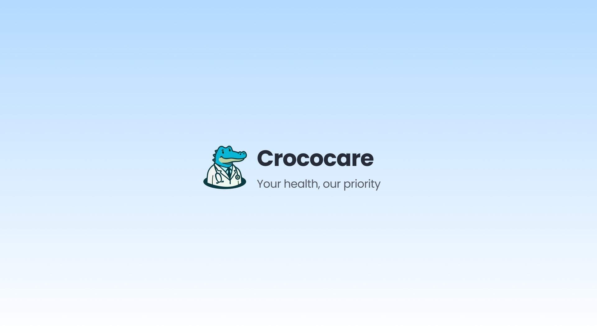

#  Croco Care

**Croco Care** is an MVP for an all-in-one healthcare web application developed for the **Digitopia Hackathon**.  
It is built using **Next.js**, **TailwindCSS**, and **Shadcn UI**.

## 🏠 Home Page
Features:
- **Today's Reminders**
- **Health Analytics** including:
  - Blood Pressure  
  - Heart Rate  
  - Temperature  
  - Other Vital Signs
- **Today's Health Tip**

## 👨‍⚕️ Doctor Page
Includes:
- **AI Medical Assistant**
- **Current Vital Signs**
- **24-Hour Health Monitoring** for:
  - Blood Pressure  
  - Heart Rate  
  - Temperature  
  - Oxygen Saturation, etc.

## 🏋️ Coach Page
Contains:
- **AI Coach Chat**
- **Analytics Overview**
  - Calories Burnt  
  - Weight  
  - Calories Gained  
  - Weekly Goals
- **Calendar Sidebar**
  - Displays daily workouts  
  - Indicates completion status (✅ Completed / ⏳ Pending)

## 📊 Reports Page
Displays **Detailed Medical Reports and Assessments** such as:

| Examination              | Result | Unit      | Normal Value     |
|--------------------------|--------|-----------|------------------|
| Complete Blood Count     | Normal | cells/μL  | 4,500–11,000     |
| Cholesterol Total        | 220    | mg/dL     | <200             |
| Blood Glucose            | 95     | mg/dL     | 70–100           |
| Hemoglobin A1C           | 5.8    | %         | <5.7             |
| Creatinine               | 1.1    | mg/dL     | 0.6–1.2          |

## ⚙️ Technologies Used
- **Next.js**
- **TailwindCSS**
- **Shadcn UI**
- **Vercel** for deployment
